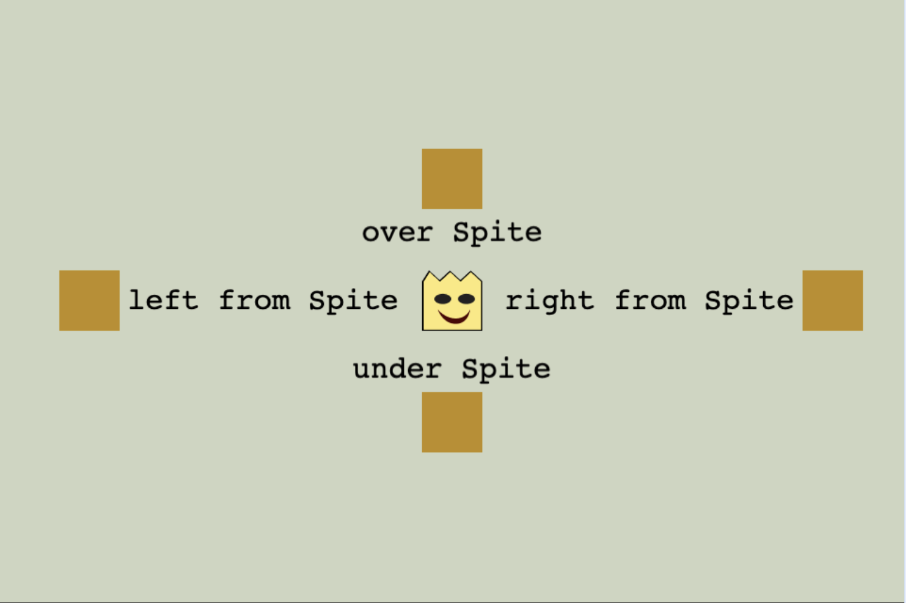

#Align 

Align is a utility class for positioning game objects relative to each other.

A library for aligning game objects in Phaser 3. This library provides a flexible and easy-to-use interface for aligning
and positioning game objects relative to each other or to the scene.

Any method works with any gameobject origin in Phaser.

## Features

- Center game objects on Phaser scene or layout anywhere inside it
- Align game objects relative to each other
- Easily configurable text and sprite alignment
- `setLeftTop` with any origin

# Code Sample

Look at [DemoScene.ts](./demo/DemoScene.ts)



```typescript
const kingSprite = this.add.sprite(0, 0, Assets.sprites.king);

const textStyle: PhaserTextStyleConfig = {
    fontSize: '32px',
    color: '#000000'
};

const text1 = this.add.text(0, 0, 'over Sprite', textStyle);
const text2 = this.add.text(0, 0, 'under Sprite', textStyle);
const text3 = this.add.text(0, 0, 'left from Sprite', textStyle);
const text4 = this.add.text(0, 0, 'right from Sprite', textStyle);

const distance = 24;
const align = new Align();

align.anchorSceneScreen(this).center(kingSprite);

align.anchor(kingSprite)
    .center(text1).topTo(text1, -distance)
    .center(text2).bottomTo(text2, distance)
    .center(text3).leftTo(text3, -distance)
    .center(text4).rightTo(text4, distance);

const rect1 = this.add.rectangle(0, 0, 64, 64, cssColorToInt('#be8e1a'));
const rect2 = this.add.rectangle(0, 0, 64, 64, cssColorToInt('#be8e1a'));
const rect3 = this.add.rectangle(0, 0, 64, 64, cssColorToInt('#be8e1a'));
const rect4 = this.add.rectangle(0, 0, 64, 64, cssColorToInt('#be8e1a'));

const rectDistance = 8;
align.anchor(text1).center(rect1).topTo(rect1, -rectDistance);
align.anchor(text2).center(rect2).bottomTo(rect2, rectDistance);
align.anchor(text3).center(rect3).leftTo(rect3, -rectDistance);
align.anchor(text4).center(rect4).rightTo(rect4, rectDistance);
```
